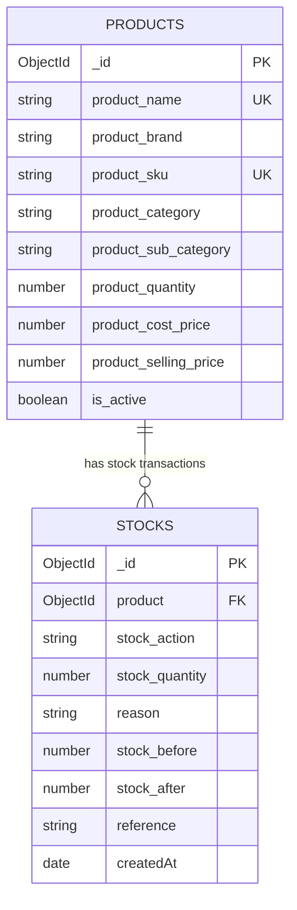
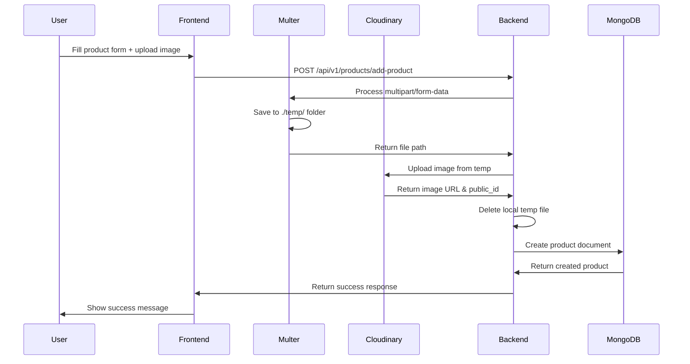
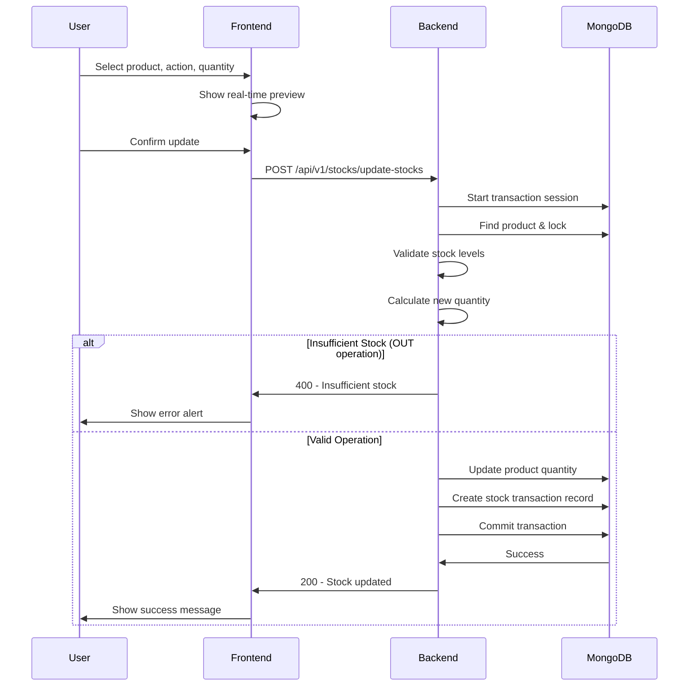
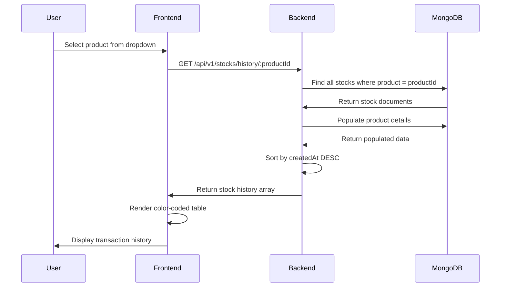

# Database Architecture & Flow Diagram

This document provides a comprehensive overview of the INVENTRIX database schema, relationships, and data flow.

---

## 📊 Database Overview

**Database Type**: MongoDB (NoSQL)  
**Connection**: MongoDB Atlas (Cloud)  
**ODM**: Mongoose

### Collections
1. **Products** - Stores product information
2. **Stocks** - Stores stock transaction history

---

## 🗄️ Collection Schemas

### 1. Products Collection

Stores all product information including inventory levels.

```javascript
{
  _id: ObjectId,
  
  // Product Identity
  product_name: String (required, unique),
  product_brand: String (required),
  product_sku: String (unique, optional),
  
  // Product Classification
  product_category: String (required),
  product_sub_category: String (required),
  product_category_lower: String (required, indexed),
  product_sub_category_lower: String (required, indexed),
  product_brand_lower: String (required, indexed),
  product_name_lower: String (required, indexed),
  
  // Product Image
  product_image: String (default: fallback URL),
  product_image_public_id: String,
  
  // Pricing
  product_cost_price: Number (required, default: 0),
  product_selling_price: Number (required, default: 0),
  product_tax: Number (required, min: 0, max: 100),
  
  // Inventory
  product_quantity: Number (required, default: 1, min: 0),
  product_min_quantity: Number (default: 5),
  product_unit: String (default: 'pcs'),
  
  // Status
  is_active: Boolean (default: true),
  
  // Timestamps
  createdAt: Date,
  updatedAt: Date
}
```

**Indexes:**
- `product_name` - Unique index
- `product_sku` - Unique sparse index
- `product_category_lower` - For category-based queries
- `product_brand_lower` - For brand filtering
- `is_active` - For active product filtering

---

### 2. Stocks Collection

Stores complete audit trail of all stock movements.

```javascript
{
  _id: ObjectId,
  
  // Reference
  product: ObjectId (ref: 'Product', required),
  
  // Transaction Details
  stock_action: String (enum: ['IN', 'OUT'], required),
  stock_quantity: Number (required, min: 1),
  reason: String (enum: ['PURCHASE', 'SALE', 'RETURN', 'DAMAGE', 'ADJUSTMENT'], required),
  
  // Reference & Notes
  reference: String (optional),    // Invoice/Bill number
  note: String (optional),         // Additional details
  
  // Stock Tracking
  stock_before: Number (required), // Stock before transaction
  stock_after: Number (required),  // Stock after transaction
  
  // Timestamps
  createdAt: Date,
  updatedAt: Date
}
```

**Indexes:**
- `product, createdAt` - Composite index for history queries
- `product, stock_action` - For filtering by action type
- `createdAt` - For chronological sorting

---

## 🔗 Relationships



### Relationship Description

- **One Product** can have **Many Stock Transactions**
- Stock transactions reference products via `product` field (ObjectId)
- Product deletion does NOT cascade to stocks (preserves audit trail)
- Stocks use `.populate('product')` to fetch product details

---

## 🔄 Data Flow Diagrams

### Product Creation Flow



---

### Stock Update Flow



---

### Stock History Retrieval Flow



---

## 🎯 Business Logic Rules

### Stock Action-Reason Matrix

Valid combinations enforced by backend:

| Stock Action | Valid Reasons |
|--------------|---------------|
| **IN** | PURCHASE, RETURN, ADJUSTMENT |
| **OUT** | SALE, DAMAGE, ADJUSTMENT |

**Validation:**
```javascript
const validMap = {
  IN: ['PURCHASE', 'RETURN', 'ADJUSTMENT'],
  OUT: ['SALE', 'DAMAGE', 'ADJUSTMENT']
};

if (!validMap[stock_action]?.includes(reason)) {
  throw new Error('Invalid action-reason combination');
}
```

---

### Stock Update Logic

**Stock IN (Adding):**
```javascript
stock_after = stock_before + stock_quantity
product.product_quantity = stock_after
```

**Stock OUT (Removing):**
```javascript
if (stock_before < stock_quantity) {
  throw new Error('Insufficient stock');
}
stock_after = stock_before - stock_quantity
product.product_quantity = stock_after
```

---

## 🔍 Query Patterns

### Common Queries

#### 1. Get All Products by Category
```javascript
Product.find({
  product_category_lower: categoryName.toLowerCase(),
  is_active: true
})
```

#### 2. Get Product Stock History
```javascript
Stock.find({ product: productId })
  .populate('product', 'product_name product_sku')
  .sort({ createdAt: -1 })
```

#### 3. Get Low Stock Products
```javascript
Product.find({
  $expr: { $lte: ['$product_quantity', '$product_min_quantity'] },
  is_active: true
})
```

#### 4. Get Total Stock Value
```javascript
Product.aggregate([
  { $match: { is_active: true } },
  {
    $project: {
      stockValue: {
        $multiply: ['$product_quantity', '$product_cost_price']
      }
    }
  },
  {
    $group: {
      _id: null,
      totalValue: { $sum: '$stockValue' }
    }
  }
])
```

---

## 🛡️ Data Integrity

### Transactions

Stock updates use **MongoDB transactions** to ensure atomicity:

```javascript
const session = await mongoose.startSession();
session.startTransaction();

try {
  // 1. Update product quantity
  await product.save({ session });
  
  // 2. Create stock record
  await Stock.create([stockData], { session });
  
  // 3. Commit if both succeed
  await session.commitTransaction();
} catch (error) {
  // Rollback on any error
  await session.abortTransaction();
  throw error;
} finally {
  session.endSession();
}
```

### Constraints

- **Unique product names** - Prevents duplicate products
- **Unique SKUs** - Each SKU must be unique (if provided)
- **Non-negative stock** - Enforced via validation
- **Required fields** - Validated before save
- **Enum values** - Stock actions and reasons are restricted

---

## 📈 Indexing Strategy

### Performance Optimization

```javascript
// Product indexes
productSchema.index({ product_category_lower: 1 });
productSchema.index({ product_brand_lower: 1 });
productSchema.index({ product_name_lower: 1 });
productSchema.index({ is_active: 1 });

// Stock indexes
stockSchema.index({ product: 1, createdAt: -1 });  // History queries
stockSchema.index({ product: 1, stock_action: 1 }); // Action filtering
stockSchema.index({ createdAt: -1 });               // Date sorting
```

**Query Performance:**
- Category filtering: O(log n) - indexed
- Product search: O(log n) - indexed
- Stock history: O(log n) - composite index
- Low stock alerts: O(n) - full scan (consider indexing if dataset grows)

---

## 🔮 Future Enhancements

### Recommended Schema Additions

1. **User Authentication**
```javascript
{
  user: ObjectId (ref: 'User'),
  role: String (enum: ['admin', 'manager', 'staff']),
  permissions: [String]
}
```

2. **Suppliers Collection**
```javascript
{
  supplier_name: String,
  contact_info: Object,
  products: [ObjectId]
}
```

3. **Orders Collection**
```javascript
{
  order_date: Date,
  customer: ObjectId,
  items: [{ product: ObjectId, quantity: Number }],
  total_amount: Number,
  status: String
}
```

4. **Stock Alerts Collection**
```javascript
{
  product: ObjectId,
  alert_type: String (enum: ['LOW_STOCK', 'OUT_OF_STOCK']),
  is_resolved: Boolean,
  created_at: Date
}
```

---

## 📊 Sample Data Structure

### Example Product Document
```json
{
  "_id": "65f1234567890abcdef12345",
  "product_name": "iPhone 15 Pro",
  "product_brand": "Apple",
  "product_sku": "APL-IP15P-001",
  "product_category": "Electronics",
  "product_sub_category": "Smartphones",
  "product_category_lower": "electronics",
  "product_sub_category_lower": "smartphones",
  "product_brand_lower": "apple",
  "product_name_lower": "iphone 15 pro",
  "product_image": "https://res.cloudinary.com/...",
  "product_image_public_id": "inventrix/abc123",
  "product_cost_price": 90000,
  "product_selling_price": 119000,
  "product_tax": 18,
  "product_quantity": 45,
  "product_min_quantity": 5,
  "product_unit": "pcs",
  "is_active": true,
  "createdAt": "2026-01-20T10:30:00.000Z",
  "updatedAt": "2026-01-25T09:45:00.000Z"
}
```

### Example Stock Transaction Document
```json
{
  "_id": "65f9876543210fedcba98765",
  "product": "65f1234567890abcdef12345",
  "stock_action": "OUT",
  "stock_quantity": 5,
  "reason": "SALE",
  "reference": "INV-2026-001",
  "note": "Walk-in customer purchase",
  "stock_before": 50,
  "stock_after": 45,
  "createdAt": "2026-01-25T09:45:00.000Z",
  "updatedAt": "2026-01-25T09:45:00.000Z"
}
```

---

## 🎓 Best Practices

### 1. Always Use Transactions for Stock Updates
Ensures data consistency between product quantity and stock records.

### 2. Maintain Audit Trail
Never delete stock transaction records - they provide complete history.

### 3. Use Lowercase Fields for Search
Enables case-insensitive queries without regex (better performance).

### 4. Leverage Indexes
All frequently queried fields should be indexed.

### 5. Validate Before Save
Use Mongoose validation and custom validators.

---

**Database designed for** ⚡ **Performance**, 🔒 **Data Integrity**, and 📊 **Scalability**
